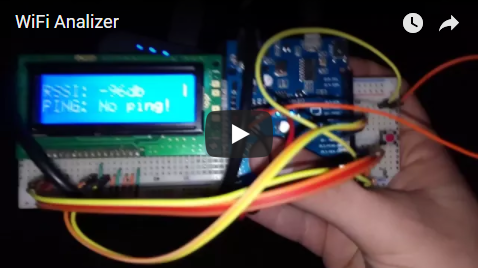

# WiFi_Analizer
Arduino based device, which connects to WiFiv and shows RSSI and PING to router

## Демонстрация работы

## Зависимости
- [Ping library]([https://github.com/dancol90/ESP8266Ping)

## Подключение
### Экран

### Питание

### Кнопка

## Лицензия
[MIT License](./LICENSE)
